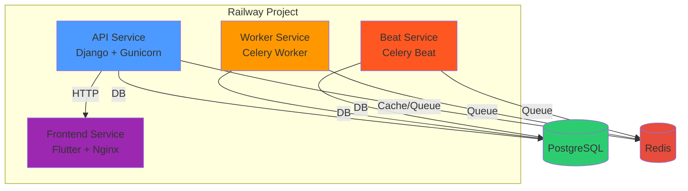
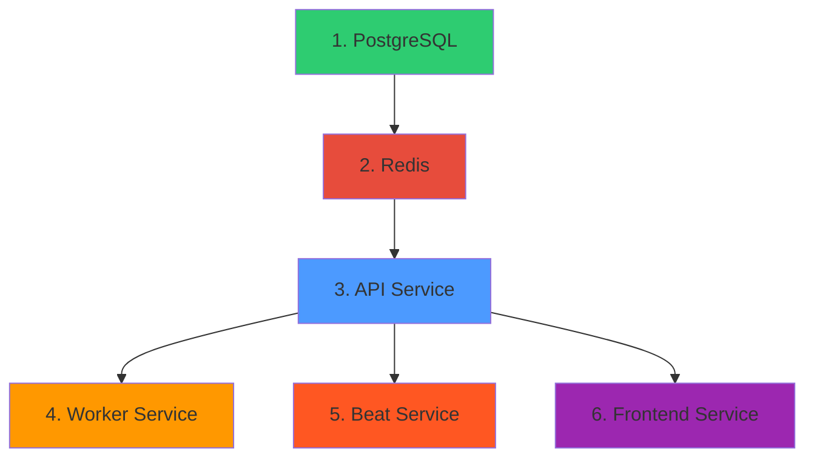

# 🚂 Guia de Deploy Multi-Serviço no Railway

Este guia explica como configurar e deployar **4 serviços separados** (API, Worker, Beat, Frontend) a partir do mesmo repositório no Railway.

## 📋 Pré-requisitos

1. Conta no Railway (https://railway.app)
2. Repositório GitHub conectado
3. Railway CLI instalado (opcional, mas recomendado)

```bash
npm install -g @railway/cli
railway login
```

## 🏗️ Arquitetura dos Serviços



## 🎯 Método 1: Via Railway Dashboard (Recomendado)

### Passo 1: Criar Projeto e Add-ons

1. **Criar Novo Projeto**
   - Acesse: https://railway.app/new
   - Clique em **"New Project"**
   - Nome sugestão: `tcc-genapp`

2. **Adicionar PostgreSQL**
   - No projeto, clique **"+ New"**
   - Selecione **"Database" → "Add PostgreSQL"**
   - Aguarde provisionamento

3. **Adicionar Redis**
   - Clique **"+ New"** novamente
   - Selecione **"Database" → "Add Redis"**
   - Aguarde provisionamento

### Passo 2: Criar Serviço API

1. **Conectar Repositório**
   - Clique **"+ New" → "GitHub Repo"**
   - Selecione seu repositório
   - Nome do serviço: `api`

2. **Configurar Build**
   - Vá em **Settings → General**
   - **Service Name**: `api`
   - Vá em **Settings → Build**
   - **Builder**: `Docker`
   - **Dockerfile Path**: `Api/Dockerfile`
   - **Docker Build Context**: `.` (root)

3. **Configurar Deploy**
   - Vá em **Settings → Deploy**
   - **Healthcheck Path**: `/admin/login/`
   - **Healthcheck Timeout**: `500`
   - **Restart Policy**: `On Failure`

4. **Configurar Variáveis de Ambiente**
   - Vá em **Variables**
   - Clique **"+ New Variable"**
   - Adicione as seguintes variáveis:

   ```env
   # Django Core
   DJANGO_SECRET_KEY=<gerar-uma-chave-segura>
   DEBUG=False
   DJANGO_ALLOWED_HOSTS=*.railway.app,*.up.railway.app
   DJANGO_SETTINGS_MODULE=config.settings
   RAILWAY_ENVIRONMENT=production
   
   # CORS
   CORS_ALLOWED_ORIGINS=https://seu-frontend-url.railway.app
   
   # Google AI
   GOOGLE_API_KEY=<sua-api-key-do-gemini>
   ```

5. **Conectar aos Bancos de Dados**
   - Em **Variables**, clique **"+ Reference"**
   - Selecione **PostgreSQL → DATABASE_URL**
   - Selecione **Redis → REDIS_URL**

6. **Deploy**
   - Clique **"Deploy"**
   - Aguarde build e healthcheck

### Passo 3: Criar Serviço Worker

1. **Novo Serviço do Mesmo Repo**
   - No projeto, clique **"+ New" → "GitHub Repo"**
   - Selecione o **MESMO repositório**
   - Nome do serviço: `worker`

2. **Configurar Build**
   - **Settings → Build**
   - **Builder**: `Docker`
   - **Dockerfile Path**: `Api/Dockerfile`
   - **Docker Build Context**: `.`

3. **Configurar Startup Command**
   - **Settings → Deploy**
   - **Custom Start Command**: `/docker-entrypoint.sh worker`
   - **Restart Policy**: `On Failure`

4. **Configurar Variáveis de Ambiente**
   - Copie as variáveis do serviço API:
   ```env
   DJANGO_SECRET_KEY=<mesma-do-api>
   DEBUG=False
   DJANGO_SETTINGS_MODULE=config.settings
   RAILWAY_ENVIRONMENT=production
   GOOGLE_API_KEY=<mesma-do-api>
   ```
   - Adicione referências:
   - **PostgreSQL → DATABASE_URL**
   - **Redis → REDIS_URL**

5. **Deploy**

### Passo 4: Criar Serviço Beat

1. **Novo Serviço do Mesmo Repo**
   - **"+ New" → "GitHub Repo"** → Mesmo repositório
   - Nome: `beat`

2. **Configurar Build**
   - **Settings → Build**
   - **Builder**: `Docker`
   - **Dockerfile Path**: `Api/Dockerfile`
   - **Docker Build Context**: `.`

3. **Configurar Startup Command**
   - **Settings → Deploy**
   - **Custom Start Command**: `/docker-entrypoint.sh beat`
   - **Restart Policy**: `On Failure`

4. **Configurar Variáveis de Ambiente**
   - Mesmas do Worker (copiar)
   - Adicionar referências aos bancos

5. **Deploy**

### Passo 5: Criar Serviço Frontend

1. **Novo Serviço do Mesmo Repo**
   - **"+ New" → "GitHub Repo"** → Mesmo repositório
   - Nome: `frontend`

2. **Configurar Build**
   - **Settings → Build**
   - **Builder**: `Docker`
   - **Dockerfile Path**: `Front/Dockerfile`
   - **Docker Build Context**: `Front`

3. **Configurar Deploy**
   - **Settings → Deploy**
   - **Healthcheck Path**: `/health`
   - **Healthcheck Timeout**: `300`
   - **Restart Policy**: `On Failure`

4. **Configurar Variáveis de Ambiente**
   ```env
   API_BASE_URL=https://api-<seu-projeto>.railway.app
   ```
   
   > **Importante**: Pegue a URL pública do serviço API depois que deployar

5. **Deploy**

### Passo 6: Configurar Domínios Públicos

Para cada serviço que precisa de acesso externo:

**API**:
1. Vá no serviço `api`
2. **Settings → Networking → Public Networking**
3. Clique **":"Generate Domain"**
4. Copie a URL (ex: `api-production-xxxx.railway.app`)

**Frontend**:
1. Vá no serviço `frontend`
2. **Settings → Networking → Public Networking**
3. Clique **"Generate Domain"**
4. Copie a URL (ex: `frontend-production-xxxx.railway.app`)

**Atualizar CORS no API**:
1. Volte no serviço `api`
2. **Variables**
3. Edite `CORS_ALLOWED ORIGINS`:
   ```env
   CORS_ALLOWED_ORIGINS=https://frontend-production-xxxx.railway.app
   ```

**Atualizar API URL no Frontend**:
1. Volte no serviço `frontend`
2. **Variables**
3. Edite `API_BASE_URL`:
   ```env
   API_BASE_URL=https://api-production-xxxx.railway.app
   ```

4. **Redeploy todos** os serviços para aplicar mudanças

## 🎯 Método 2: Via Railway CLI (Avançado)

### Instalação e Login

```bash
npm install -g @railway/cli
railway login
railway link  # Conectar ao projeto existente
```

### Deploy de Cada Serviço

```bash
# 1. Deploy API
railway up --service api --dockerfile Api/Dockerfile

# 2. Deploy Worker
railway up --service worker --dockerfile Api/Dockerfile

# 3. Deploy Beat
railway up --service beat --dockerfile Api/Dockerfile

# 4. Deploy Frontend
railway up --service frontend --dockerfile Front/Dockerfile
```

### Configurar Start Commands via CLI

```bash
# Worker
railway service api --command "/docker-entrypoint.sh worker"

# Beat
railway service beat --command "/docker-entrypoint.sh beat"
```

## ✅ Verificação Pós-Deploy

### 1. Verificar Status dos Serviços

No Railway Dashboard:
- **api**: Status `RUNNING`, com healthcheck `HEALTHY`
- **worker**: Status `RUNNING`
- **beat**: Status `RUNNING`
- **frontend**: Status `RUNNING`, com healthcheck `HEALTHY`

### 2. Verificar Logs

**API Logs** (deve mostrar):
```
🚀 Docker Entrypoint - Starting Django Service
🌐 Starting API Service (Gunicorn)
✅ Database is ready!
🔄 Running database migrations...
✅ Database initialization complete!
🌐 Starting Gunicorn server on port 8080...
[INFO] Booting worker with pid: xxxx
```

**Worker Logs** (deve mostrar):
```
🚀 Docker Entrypoint - Starting Django Service
👷 Starting Celery Worker Service
✅ Database is ready!
🔄 Starting Celery Worker...
[INFO] celery@worker-xxx ready.
```

**Beat Logs** (deve mostrar):
```
🚀 Docker Entrypoint - Starting Django Service
⏰ Starting Celery Beat Service
✅ Database is ready!
📅 Starting Celery Beat Scheduler...
[INFO] DatabaseScheduler: Schedule changed.
```

**Frontend Logs** (deve mostrar):
```
Starting Flutter web build...
Building release mode...
✅ Build complete
Starting nginx server...
```

### 3. Testar Aplicação

1. **Acessar Frontend**: `https://frontend-production-xxxx.railway.app`
2. **Acessar Admin**: `https://api-production-xxxx.railway.app/admin/login/`
3. **Testar API**: 
   ```bash
   curl https://api-production-xxxx.railway.app/api/health/
   ```

## 🔧 Troubleshooting

### API não inicia (Healthcheck failing)

**Problema**: Migrations não rodaram
**Solução**:
1. Verifique logs do serviço `api`
2. Procure por erros de conexão ao PostgreSQL
3. Verifique se `DATABASE_URL` está configurado
4. Redeploy o serviço

### Worker/Beat não conectam ao Redis

**Problema**: `REDIS_URL` não está configurado
**Solução**:
1. Vá em **Variables** do serviço
2. Adicione **Reference → Redis → REDIS_URL**
3. Redeploy

### Frontend não comunica com API

**Problema**: CORS bloqueado ou `API_BASE_URL` errado
**Solução**:
1. Verifique `API_BASE_URL` no frontend (deve ser HTTPS completo)
2. Verifique `CORS_ALLOWED_ORIGINS` no API (deve incluir URL do frontend)
3. Redeploy ambos serviços

### Builds falhando

**Problema**: Dockerfile não encontrado
**Solução**:
1. Verifique **Dockerfile Path** está correto
2. Verifique **Docker Build Context** está correto
3. Para Frontend: Context deve ser `Front`, não `.`

## 📊 Ordem de Inicialização Recomendada



1. **PostgreSQL** - Criar primeiro
2. **Redis** - Criar segundo
3. **API** - Deploy e aguardar healthcheck passar
4. **Worker** - Deploy após API estar saudável
5. **Beat** - Deploy após API estar saudável
6. **Frontend** - Deploy por último, após pegar URL do API

## 🎉 Deployment Completo!

Após seguir todos os passos, você terá:

- ✅ **API**: Django + Gunicorn rodando com migrations
- ✅ **Worker**: Celery processando tarefas assíncronas
- ✅ **Beat**: Celery agendando tarefas periódicas
- ✅ **Frontend**: Flutter Web servido via Nginx
- ✅ **PostgreSQL**: Banco de dados compartilhado
- ✅ **Redis**: Cache e fila compartilhados

**URLs Públicas**:
- Frontend: `https://frontend-production-xxxx.railway.app`
- API: `https://api-production-xxxx.railway.app`

---

**Precisa de ajuda?** Consulte a documentação oficial: https://docs.railway.app
